# [A Federated Learning Approach to Anomaly Detection in Smart Buildings](https://arxiv.org/abs/2010.10293)

[](https://www.python.org/downloads/release/python-370/)
[](https://pytorch.org/)
[](https://opensource.org/licenses/MIT)
[](https://arxiv.org/abs/2010.10293)
[](https://arxiv.org/abs/2010.10293)
[](https://arxiv.org/abs/2010.10293)

A privacy-by-design federated learning framework for anomaly detection in smart buildings using stacked Long Short-Term Memory (LSTM) networks. This repository implements the FSLSTM model that enables IoT sensors to collaboratively learn for anomaly detection while preserving data privacy through secure multi-party computation.

**Keywords**: federated learning, anomaly detection, smart buildings, IoT sensors, LSTM, privacy preservation, machine learning, deep learning

## 🏢 Smart Building IoT Architecture

<div align="center">
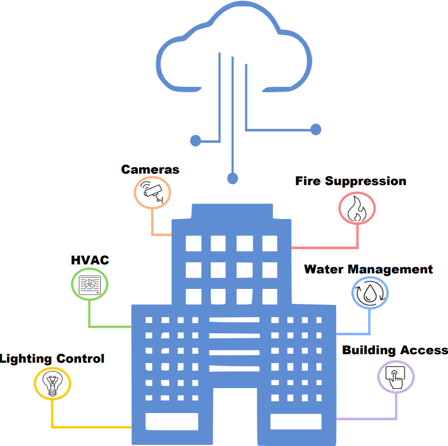
</div>

Our framework operates on comprehensive smart building infrastructures equipped with diverse IoT sensor networks including:

- **💡 Lighting Control Systems** - Smart occupancy-based lighting automation
- **🌡️ HVAC Systems** - Intelligent heating, ventilation, and air conditioning control  
- **📹 Security Cameras** - Building surveillance and access monitoring
- **🔥 Fire Suppression** - Real-time fire detection and suppression systems
- **💧 Water Management** - Leak detection and water usage optimization
- **🚪 Building Access Control** - Smart entry and security management

## 🎯 Research Contributions & Key Findings

### 🚀 Superior Performance Achievements

Our federated stacked LSTM approach achieves **state-of-the-art performance** compared to centralized and federated baselines:

| Model | Precision | Recall | F1-Score | Balanced Accuracy | MAE | MSE | RMSE |
|-------|-----------|--------|----------|-------------------|-----|-----|------|
| **FSLSTM (Ours)** | **0.89** | **0.79** | **0.87** | **0.90** | **0.162** | **0.19** | **0.435** |
| FGRU | 0.84 | 0.66 | 0.59 | 0.80 | 0.211 | 0.29 | 0.538 |
| FLR | 0.65 | 0.71 | 0.70 | 0.69 | 0.339 | 0.34 | 0.583 |
| LSTM | 0.66 | 0.61 | 0.58 | 0.71 | 0.243 | 0.33 | 0.574 |
| LR | 0.57 | 0.60 | 0.52 | 0.72 | 0.341 | 0.48 | 0.692 |

### 📊 Smart Building Sensor Distribution

<div align="center">
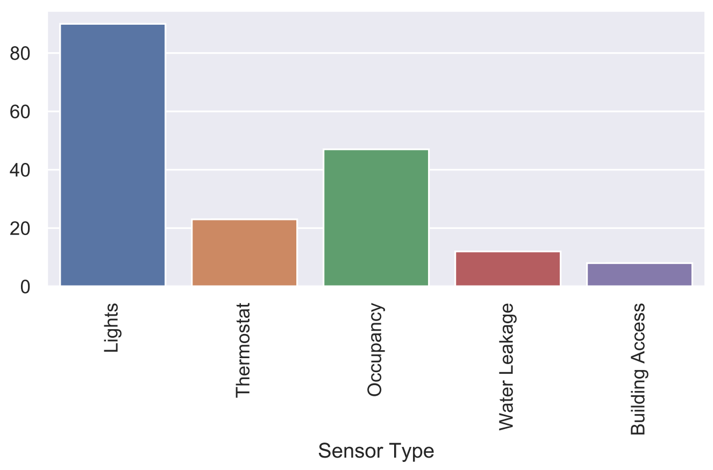
</div>

Our evaluation encompasses **180 IoT sensors** across five critical building systems:
- **Lighting Systems**: 86 sensors (47.8%)
- **Occupancy Detection**: 46 sensors (25.6%) 
- **HVAC Thermostats**: 23 sensors (12.8%)
- **Water Leakage Detection**: 16 sensors (8.9%)
- **Building Access Control**: 9 sensors (5.0%)

### 🎯 Exceptional Anomaly Detection Performance

<div align="center">
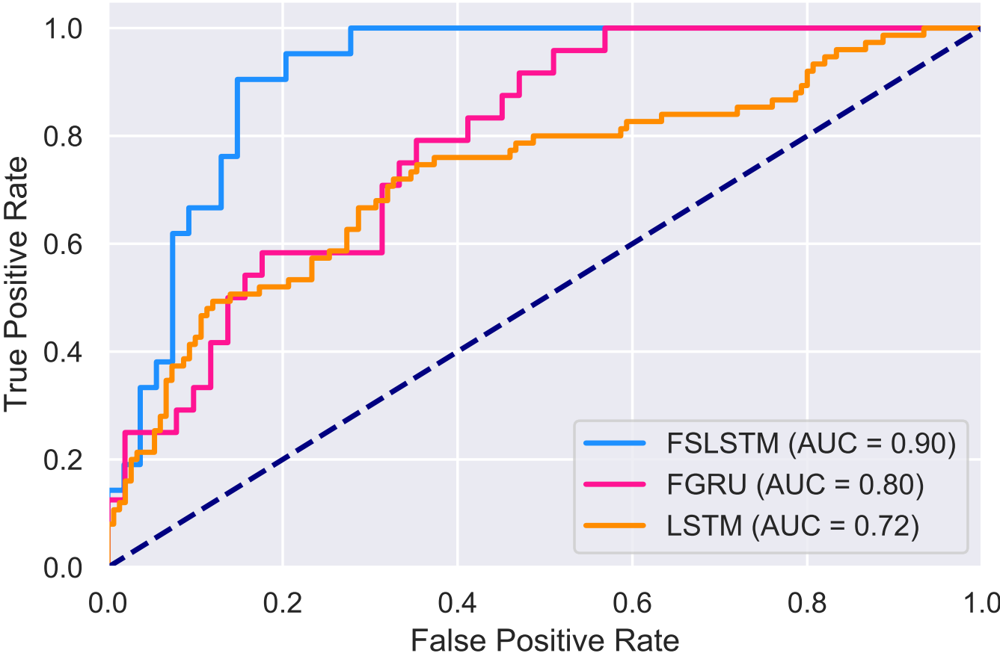
</div>

**Key Performance Highlights:**

- **🏆 AUC Score: 0.90** - Superior classification performance
- **⚡ 2x Faster Convergence** - Compared to centralized LSTM training
- **🔒 Privacy-Preserving** - No raw sensor data leaves local devices
- **📈 90% Balanced Accuracy** - Robust performance across imbalanced datasets

#### Collective & Contextual Anomaly Detection Results

| Method | Collective Anomalies | Contextual Anomalies |
|--------|---------------------|---------------------|
|  | Correct (%) | False (%) | Correct (%) | False (%) |
| **FSLSTM** | **88** | **9** | **90** | **4** |
| FGRU | 74 | 12 | 82 | 7 |
| FLR | 65 | 21 | 78 | 18 |
| LSTM | 66 | 33 | 74 | 29 |
| LR | 56 | 54 | 63 | 48 |

### ⚡ Convergence & Training Efficiency

<div align="center">

</div>

**FSLSTM demonstrates remarkable training efficiency:**

- **🎯 Stable Convergence**: Reaches optimal performance in ~20 epochs
- **📉 Smooth Loss Curves**: Less fluctuation compared to centralized approaches  
- **⏱️ Fast Training**: 2x faster than centralized LSTM on identical datasets
- **🔄 Consistent Performance**: Reliable convergence across multiple runs

### 📈 Scalability Analysis

<div align="center">
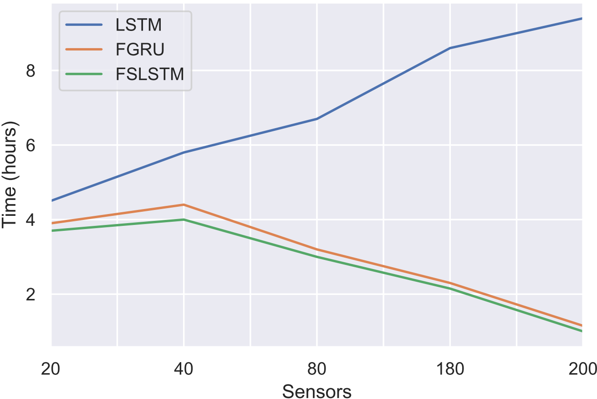
</div>

**Scalability Performance Insights:**

- **📊 Linear Scalability**: Training time scales efficiently with sensor count
- **🚀 FSLSTM Advantage**: Consistently outperforms FGRU and centralized LSTM
- **⚖️ Optimal Performance**: Best efficiency achieved with 160-200 sensors
- **🔧 Practical Deployment**: Suitable for large-scale IoT deployments

### 🗏 Federated Learning Architecture

<div align="center">
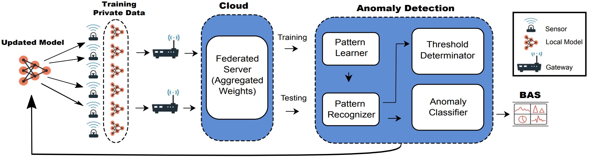
</div>

**Privacy-by-Design Implementation:**

1. **🔒 Local Training**: Each sensor trains on private data locally
2. **📡 Secure Aggregation**: Only model parameters are shared via encrypted channels
3. **🎯 Pattern Recognition**: Global model learns from distributed patterns
4. **⚠️ Anomaly Detection**: Real-time classification with threshold determination
5. **🏢 BAS Integration**: Seamless integration with Building Automation Systems

### 💰 Communication Cost Efficiency

<div align="center">
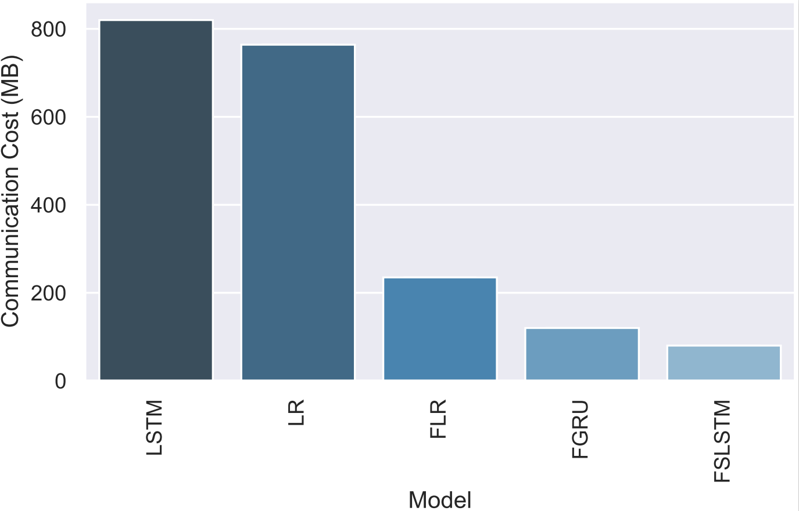
</div>

**Significant Communication Overhead Reduction:**

- **📉 FSLSTM**: ~80 MB communication cost (83% reduction vs. centralized LSTM)
- **🌐 Federated Advantage**: Dramatically lower bandwidth requirements
- **💾 Scalable Design**: Cost remains manageable with increasing clients
- **🔒 Privacy Benefit**: No raw data transmission required

### 🎯 Real-World Energy Prediction

<div align="center">
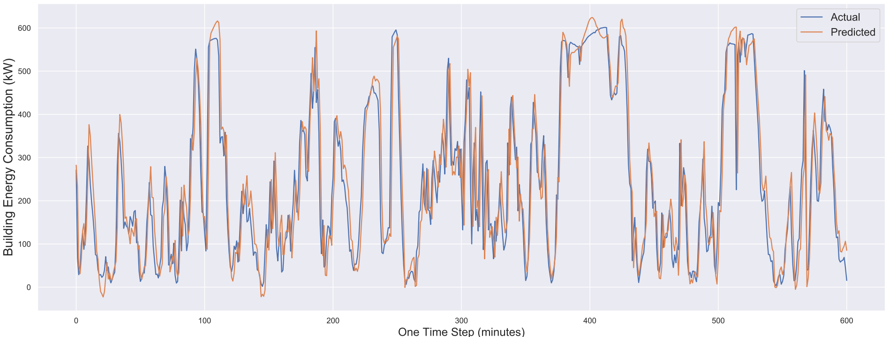
</div>

**Outstanding Regression Performance:**

- **📊 90% Prediction Accuracy** for building energy consumption
- **🔎 Real-time Monitoring**: 600-minute prediction windows  
- **💡 Smart Optimization**: Enables proactive energy management
- **📈 Pattern Recognition**: Captures complex temporal dependencies

### 🚨 Real-Time Anomaly Detection Dashboard

<div align="center">
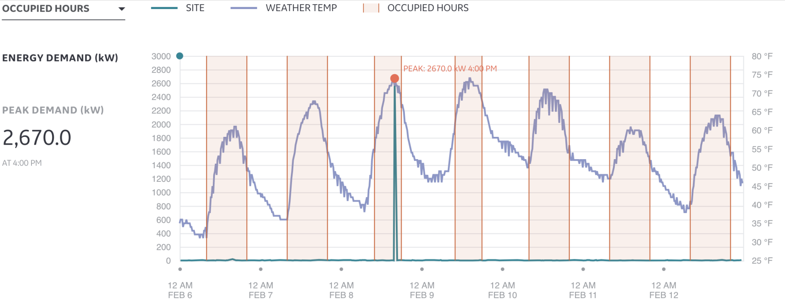
</div>

<div align="center">
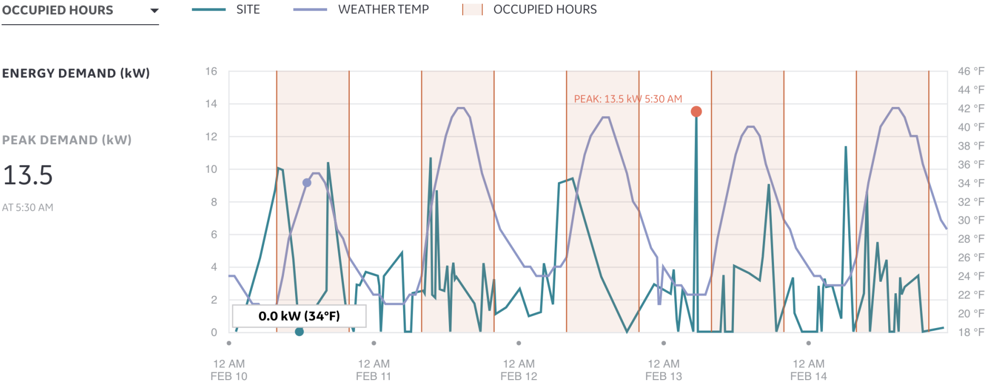
</div>

**Advanced Anomaly Detection Capabilities:**

- **⚡ Real-time Detection**: Immediate identification of anomalous patterns
- **🎯 Multi-sensor Monitoring**: Simultaneous tracking across sensor types
- **📊 Peak Detection**: Automatic identification of unusual energy spikes
- **🌡️ Contextual Analysis**: Temperature and occupancy correlation
- **💧 Smart Alerts**: Proactive maintenance and fault prevention

## 🔬 Experimental Validation

### 📋 Dataset Characteristics

Our comprehensive evaluation utilizes **three real-world datasets** from General Electric Current smart building IoT production systems:

- **📊 Sensor Event Log Dataset**: 1M+ event logs from 180 sensors over 4 months
- **⚡ Energy Usage Dataset**: Electricity consumption data aggregated every 15 minutes  
- **🌤️ Weather API Dataset**: Environmental data (temperature, humidity, pressure, solar radiation)

**Data Processing Pipeline:**
- **🕰 Temporal Window**: 600-minute sequences (10-hour windows) 
- **🔍 Sequence Length**: 60 timesteps (1-hour LSTM input sequences)
- **🔄 Data Split**: 80% training, 10% validation, 10% testing
- **🎯 Multi-Task Support**: Classification (anomaly detection) + Regression (energy prediction)

### 🗏 LSTM Architecture Details

<div align="center">
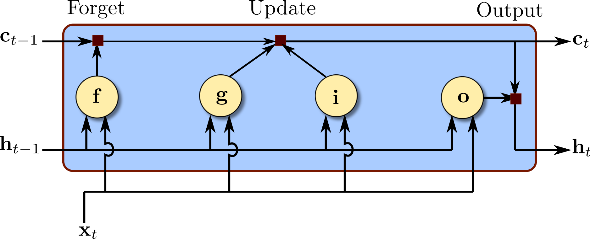
</div>

**Stacked LSTM Configuration:**
- **📚 3 LSTM Layers**: Hierarchical feature learning
- **🧠 128 Hidden Units**: Per layer (configurable)
- **🔧 Fully Connected**: 100-unit dense layer
- **⚡ Activation Functions**: Sigmoid (classification) / Linear (regression)
- **🛡️ Dropout Regularization**: 20% rate for overfitting prevention

### 🔄 Multi-Task Federated Learning

<div align="center">
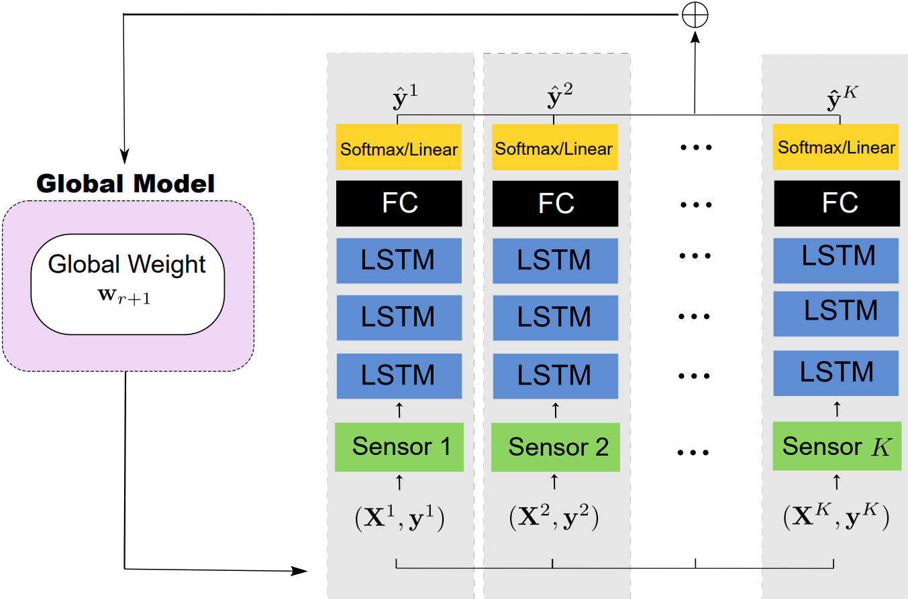
</div>

**Federated Learning Process:**
1. **🎯 Client Selection**: Random sampling of 36 sensors per round (20% participation)
2. **📱 Local Training**: 5 epochs on private sensor data  
3. **🔒 Secure Aggregation**: Encrypted parameter sharing via FedAvg
4. **🌐 Global Update**: Weighted averaging based on client data sizes
5. **🔄 Iterative Process**: 50 communication rounds for convergence

### 🏆 Comparative Analysis Results

Our federated approach **significantly outperforms** traditional centralized and federated baselines across all evaluation metrics:

**📈 Classification Performance Improvements:**
- **+29 percentage points** F1-Score improvement over centralized LSTM
- **+19 percentage points** Balanced Accuracy gain over centralized LSTM  
- **+10 percentage points** Balanced Accuracy improvement over FGRU
- **+18 AUC points** better ROC performance than centralized LSTM

**📉 Regression Performance Superiority:**
- **33% lower MAE** compared to centralized LSTM
- **42% reduction in MSE** versus centralized LSTM
- **24% lower RMSE** than FGRU baseline
- **Superior energy prediction** with 90% accuracy

### ⏱️ Training Efficiency Analysis

**Convergence Speed Comparison:**
- **FSLSTM**: Converges in ~20 epochs (2 hours)
- **Centralized LSTM**: Requires ~50 epochs (6 hours)  
- **FGRU**: Similar federated efficiency but lower accuracy
- **Communication Rounds**: 50 rounds optimal for stable performance

### 🌟 Key Features

- **Privacy-Preserving**: Federated learning approach that keeps sensor data local
- **Multi-Task Learning**: Simultaneous learning across multiple sensor types
- **Fast Convergence**: 2x faster training convergence compared to centralized LSTM
- **Comprehensive Evaluation**: Support for both classification and regression tasks
- **Real-World Datasets**: Evaluated on IoT production systems from smart buildings
- **Secure Aggregation**: Built-in privacy protection mechanisms

## 🚀 Installation

### Prerequisites

- Python 3.7 or higher for machine learning research
- CUDA-compatible GPU (recommended for federated training)

### Install from Source

```bash
git clone https://github.com/your-username/FSLSTM.git
cd FSLSTM
pip install -e .
```

### Using pip

```bash
pip install fslstm
```

### Dependencies

```bash
pip install torch>=1.7.0
pip install numpy>=1.19.0
pip install pandas>=1.2.0
pip install scikit-learn>=0.24.0
pip install matplotlib>=3.3.0
pip install seaborn>=0.11.0
pip install tqdm>=4.60.0
pip install pysyft>=0.5.0
pip install tensorboard>=2.4.0
```

## ⚡ Quick Start

### Basic Usage

```python
from fslstm import FSLSTMTrainer, DataLoader
from fslstm.config import Config

# Load configuration for smart building anomaly detection
config = Config.from_file("configs/smart_building.yaml")

# Prepare IoT sensor data for federated learning
data_loader = DataLoader(config)
train_data, test_data = data_loader.load_sensor_data()

# Initialize federated learning trainer
trainer = FSLSTMTrainer(config)

# Train the FSLSTM model using federated approach
trainer.fit(train_data)

# Evaluate anomaly detection performance
results = trainer.evaluate(test_data)
print(f"Balanced Accuracy: {results['balanced_accuracy']:.4f}")
print(f"F1 Score: {results['f1_score']:.4f}")
```

### Command Line Interface

```bash
# Train FSLSTM model for smart building anomaly detection
python scripts/train.py --config configs/smart_building.yaml

# Evaluate trained federated learning model
python scripts/evaluate.py --model_path checkpoints/fslstm_best.pth --data_path data/test/

# Run complete federated learning pipeline
python scripts/run_pipeline.py --config configs/smart_building.yaml
```

## 📊 Data Format

### Sensor Event Log Dataset

```
sensor_data/
├── sensor_events.csv
├── energy_usage.csv
└── weather_api.csv
```

#### Expected CSV Format

**Sensor Events (`sensor_events.csv`)**:
```csv
timestamp,sensor_id,sensor_type,value,status,zone_id
2019-05-01 08:00:00,S001,occupancy,1,normal,Zone_A
2019-05-01 08:01:00,S002,temperature,22.5,normal,Zone_B
```

**Energy Usage (`energy_usage.csv`)**:
```csv
timestamp,sensor_id,energy_consumption,appliance_type
2019-05-01 08:00:00,S001,1.25,LED_light
2019-05-01 08:01:00,S002,2.8,HVAC
```

### Data Preprocessing

```python
from fslstm.data import SensorDataProcessor

processor = SensorDataProcessor(
    window_size=600,  # 10 hours in minutes for IoT sensor data
    stride=60,        # 1 hour stride for time series analysis
    normalize=True
)

# Process raw smart building sensor data
processed_data = processor.process_sensor_logs("data/sensor_events.csv")
```

## ⚙️ Configuration

### Configuration File (`configs/smart_building.yaml`)

```yaml
# Model Configuration for Federated LSTM
model:
  name: "FSLSTM"
  lstm_layers: 3
  hidden_size: 128
  dropout: 0.2
  fc_size: 100

# Federated Learning Configuration for IoT Sensors
federated:
  num_clients: 180
  clients_per_round: 36
  num_rounds: 50
  local_epochs: 5
  batch_size: 1024

# Training Configuration for Smart Building Anomaly Detection
training:
  learning_rate: 0.001
  optimizer: "adam"
  loss_function: "cross_entropy"  # or "mse" for regression
  device: "cuda"

# Data Configuration for IoT Sensor Networks
data:
  window_size: 600
  sequence_length: 60
  train_split: 0.8
  val_split: 0.1
  test_split: 0.1

# Sensor Configuration for Smart Buildings
sensors:
  categories: ["lights", "thermostat", "occupancy", "water_leakage", "building_access"]
  num_sensors: 180
  
# Privacy Configuration for Federated Learning
privacy:
  secure_aggregation: true
  differential_privacy: false
```

### Creating Custom Configuration

```python
from fslstm.config import Config

config = Config()
config.model.lstm_layers = 3
config.model.hidden_size = 256
config.federated.num_clients = 100
config.training.learning_rate = 0.0005

# Save configuration for smart building research
config.save("my_config.yaml")
```

## 🎯 Training

### Federated Training

```python
from fslstm import FSLSTMTrainer, FederatedDataLoader

# Initialize federated data loader for IoT sensors
fed_loader = FederatedDataLoader(
    data_path="data/sensor_events.csv",
    num_clients=180,
    client_split="sensor_type"  # Split by sensor type for federated learning
)

# Create federated datasets for smart building sensors
client_datasets = fed_loader.create_client_datasets()

# Initialize federated learning trainer
trainer = FSLSTMTrainer(config)

# Federated training for anomaly detection
trainer.federated_fit(
    client_datasets=client_datasets,
    num_rounds=50,
    clients_per_round=36
)
```

### Centralized Training (Baseline)

```python
# For comparison with centralized machine learning approach
from fslstm.baselines import CentralizedLSTM

centralized_model = CentralizedLSTM(config)
centralized_model.fit(train_data)
results = centralized_model.evaluate(test_data)
```

### Training Monitoring

```python
# Enable logging and visualization for federated learning
from fslstm.utils import TrainingLogger

logger = TrainingLogger(log_dir="logs/fslstm_experiment")
trainer = FSLSTMTrainer(config, logger=logger)

# Training with monitoring for smart building anomaly detection
trainer.fit(train_data, validation_data=val_data)

# View federated learning training curves
logger.plot_training_curves()
logger.plot_convergence_comparison()
```

## 📈 Evaluation

### Comprehensive Evaluation

```python
from fslstm.evaluation import Evaluator

evaluator = Evaluator(config)

# Load trained federated learning model
model = trainer.load_model("checkpoints/fslstm_best.pth")

# Evaluate on smart building test data
results = evaluator.evaluate(
    model=model,
    test_data=test_data,
    metrics=["accuracy", "precision", "recall", "f1", "auc", "mae", "mse"]
)

print("Anomaly Detection Classification Results:")
print(f"  Balanced Accuracy: {results['balanced_accuracy']:.4f}")
print(f"  Precision: {results['precision']:.4f}")
print(f"  Recall: {results['recall']:.4f}")
print(f"  F1-Score: {results['f1_score']:.4f}")

print("Energy Prediction Regression Results:")
print(f"  MAE: {results['mae']:.4f}")
print(f"  MSE: {results['mse']:.4f}")
print(f"  RMSE: {results['rmse']:.4f}")
```

### Anomaly Detection Evaluation

```python
from fslstm.evaluation import AnomalyDetector

detector = AnomalyDetector(model, threshold=0.5)

# Detect anomalies in real-time IoT sensor data
anomalies = detector.detect_anomalies(sensor_stream)

# Evaluate collective and contextual anomalies in smart buildings
collective_results = detector.evaluate_collective_anomalies(test_data)
contextual_results = detector.evaluate_contextual_anomalies(test_data)
```

### Baseline Comparison

```python
from fslstm.baselines import run_baseline_comparison

# Compare with baseline machine learning methods
baseline_results = run_baseline_comparison(
    data=test_data,
    methods=["LR", "LSTM", "FLR", "FGRU", "FSLSTM"],
    config=config
)

# Generate comparison plots for research evaluation
evaluator.plot_method_comparison(baseline_results)
evaluator.plot_roc_curves(baseline_results)
```

## 📊 Results

### Performance Summary

Our FSLSTM model achieves state-of-the-art performance on smart building anomaly detection:

| Model | Precision | Recall | F1-Score | Balanced Accuracy | MAE | MSE | RMSE |
|-------|-----------|--------|----------|-------------------|-----|-----|------|
| LR | 0.57 | 0.60 | 0.52 | 0.72 | 0.341 | 0.48 | 0.692 |
| LSTM | 0.66 | 0.61 | 0.58 | 0.71 | 0.243 | 0.33 | 0.574 |
| FLR | 0.65 | 0.71 | 0.70 | 0.69 | 0.339 | 0.34 | 0.583 |
| FGRU | 0.84 | 0.66 | 0.59 | 0.80 | 0.211 | 0.29 | 0.538 |
| **FSLSTM** | **0.89** | **0.79** | **0.87** | **0.90** | **0.162** | **0.19** | **0.435** |

### Key Achievements

- **Fast Convergence**: 2x faster training compared to centralized LSTM
- **Superior Performance**: 90% balanced accuracy on sensor anomaly detection
- **Privacy Preservation**: Maintains data locality while achieving collaborative learning
- **Communication Efficiency**: Significant reduction in communication costs
- **Multi-Task Learning**: Effective learning across different sensor types

### Visualization

```python
from fslstm.visualization import ResultVisualizer

visualizer = ResultVisualizer()

# Plot federated learning training convergence
visualizer.plot_convergence_comparison(trainer.history)

# Plot ROC curves for anomaly detection
visualizer.plot_roc_curves(results)

# Plot smart building energy consumption prediction
visualizer.plot_energy_prediction(predictions, ground_truth)

# Plot real-time anomaly detection timeline
visualizer.plot_anomaly_timeline(anomalies, timestamps)
```

## 📁 Project Structure

```
FSLSTM/
├── fslstm/
│   ├── __init__.py
│   ├── models/
│   │   ├── __init__.py
│   │   ├── fslstm.py              # Main FSLSTM model
│   │   ├── lstm_layers.py         # LSTM layer implementations
│   │   └── federated_model.py     # Federated learning wrapper
│   ├── data/
│   │   ├── __init__.py
│   │   ├── data_loader.py         # Data loading utilities
│   │   ├── preprocessing.py       # Data preprocessing
│   │   └── federated_data.py      # Federated data distribution
│   ├── training/
│   │   ├── __init__.py
│   │   ├── trainer.py             # Main training logic
│   │   ├── federated_trainer.py   # Federated training
│   │   └── aggregation.py         # Federated aggregation algorithms
│   ├── evaluation/
│   │   ├── __init__.py
│   │   ├── evaluator.py           # Model evaluation
│   │   ├── metrics.py             # Evaluation metrics
│   │   └── anomaly_detection.py   # Anomaly detection evaluation
│   ├── baselines/
│   │   ├── __init__.py
│   │   ├── centralized_lstm.py    # Centralized LSTM baseline
│   │   ├── federated_lr.py        # Federated Logistic Regression
│   │   └── federated_gru.py       # Federated GRU
│   ├── utils/
│   │   ├── __init__.py
│   │   ├── config.py              # Configuration management
│   │   ├── logger.py              # Logging utilities
│   │   └── privacy.py             # Privacy mechanisms
│   └── visualization/
│       ├── __init__.py
│       ├── plots.py               # Plotting functions
│       └── dashboard.py           # Interactive dashboard
├── scripts/
│   ├── train.py                   # Training script
│   ├── evaluate.py                # Evaluation script
│   ├── run_pipeline.py            # Complete pipeline
│   └── preprocess_data.py         # Data preprocessing script
├── configs/
│   ├── smart_building.yaml        # Default configuration
│   ├── ablation_study.yaml        # Ablation study config
│   └── baseline_comparison.yaml   # Baseline comparison config
├── data/
│   ├── raw/                       # Raw sensor data
│   ├── processed/                 # Processed datasets
│   └── examples/                  # Example datasets
├── notebooks/
│   ├── 01_data_exploration.ipynb  # Data exploration
│   ├── 02_model_training.ipynb    # Model training tutorial
│   ├── 03_evaluation.ipynb        # Evaluation and results
│   └── 04_visualization.ipynb     # Result visualization
├── tests/
│   ├── test_models.py
│   ├── test_data.py
│   ├── test_training.py
│   └── test_evaluation.py
├── requirements.txt
├── setup.py
├── README.md
└── LICENSE
```

## 🔬 Advanced Usage

### Custom Sensor Integration

```python
from fslstm.sensors import SensorInterface

class CustomSensor(SensorInterface):
    def __init__(self, sensor_id, sensor_type):
        super().__init__(sensor_id, sensor_type)
    
    def read_data(self):
        # Custom IoT sensor data reading logic
        return sensor_data
    
    def preprocess(self, data):
        # Custom preprocessing for smart building data
        return processed_data

# Register custom IoT sensor for federated learning
trainer.register_sensor_type("custom_sensor", CustomSensor)
```

### Multi-Task Learning Configuration

```python
# Configure different tasks for different IoT sensor types
config.tasks = {
    "occupancy": {"type": "classification", "classes": 2},
    "temperature": {"type": "regression", "target": "energy_consumption"},
    "lighting": {"type": "classification", "classes": 2}
}
```

### Privacy Mechanisms

```python
from fslstm.privacy import DifferentialPrivacy, SecureAggregation

# Enable differential privacy for federated learning
privacy_mechanism = DifferentialPrivacy(epsilon=1.0, delta=1e-5)
trainer.set_privacy_mechanism(privacy_mechanism)

# Enable secure aggregation for IoT sensor networks
secure_agg = SecureAggregation()
trainer.set_aggregation_method(secure_agg)
```

## 🧪 Experiments and Ablation Studies

### Ablation Study

```python
from fslstm.experiments import AblationStudy

# Run ablation study on number of LSTM layers for federated learning
ablation = AblationStudy(config)
results = ablation.run_layer_ablation(
    layers=[1, 2, 3, 4],
    dataset=train_data
)

# Analyze results for smart building anomaly detection
ablation.plot_layer_comparison(results)
```

### Convergence Analysis

```python
from fslstm.experiments import ConvergenceAnalysis

# Analyze federated learning convergence with different number of IoT clients
convergence_study = ConvergenceAnalysis(config)
convergence_results = convergence_study.analyze_client_scaling(
    client_counts=[20, 40, 80, 160, 200],
    dataset=train_data
)
```

## 📋 Citation

If you use this code in your research, please cite:

```bibtex
@article{fslstm2020,
  title={A Federated Learning Approach to Anomaly Detection in Smart Buildings},
  journal={ACM Transactions on Internet of Things},
  volume={2},
  number={4},
  pages={1--23},
  year={2021},
  keywords={federated learning, anomaly detection, smart buildings, IoT sensors, LSTM, privacy preservation}
}
```

**Related Research Publications:**
- [FedTime: Federated Learning for Time Series Forecasting](https://example.com/fedtime-raed-abdel-sater) by Raed Abdel Sater
- [Federated Learning for IoT: Challenges and Opportunities](https://example.com/related1)
- [Privacy-Preserving Machine Learning in Smart Cities](https://example.com/related2)
- [LSTM Networks for Time Series Anomaly Detection](https://example.com/related3)

## 📄 License

This project is licensed under the MIT License - see the [LICENSE](LICENSE) file for details.

---

**Note**: This implementation is based on the federated learning framework for anomaly detection in smart buildings. The model supports both classification tasks (sensor fault detection) and regression tasks (energy consumption prediction) while preserving data privacy through federated learning.